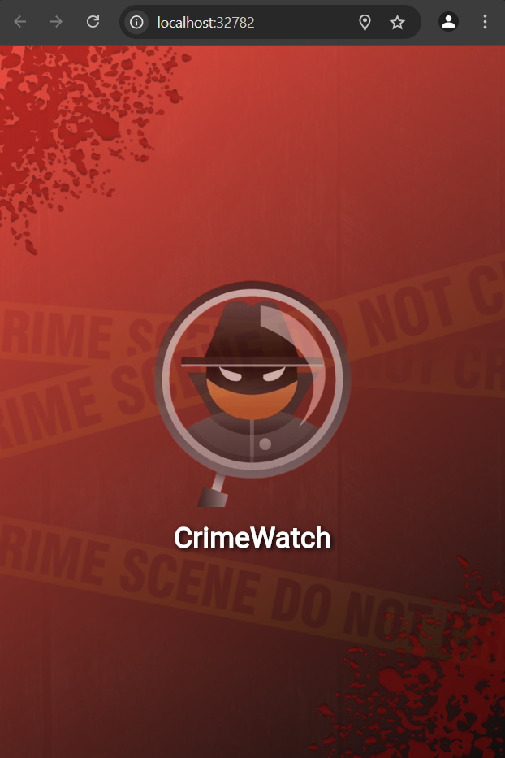
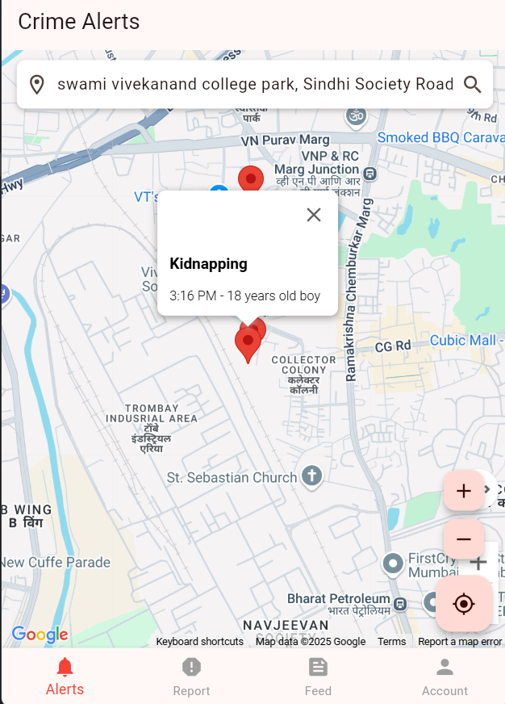
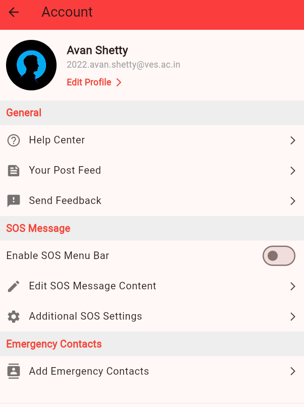

# 🚨 Crime Alert

**Real-Time Crime Reporting & Community Safety App**  
*Empowering Communities. Enhancing Safety.*

[](#)
[](#)

---

##  Table of Contents

- [Features](#features)
- [Screenshots](#screenshots)
- [Installation](#installation)
- [Project Structure](#project-structure)
- [Dependencies](#dependencies)
- [APIs Used](#apis-used)
- [Usage](#usage)
- [Contributing](#contributing)
- [Acknowledgments](#acknowledgments)
- [Contact](#contact)

---

## ✨ Features

- 📝 **Crime Reporting:** Submit detailed crime reports with location, type, description, and evidence.
- 🗺️ **Real-Time Alerts:** View crime alerts on a live map with incident markers.
- 👤 **User Profiles:** Manage and update your profile and personal info.
- 🚨 **SOS Messaging:** Instantly send emergency SOS messages to contacts or authorities.
- 📰 **Post Feed:** Share & view posts related to safety and crime prevention.

---

## 📱 Screenshots

> _UI of my Catch-Crime App!_

| Home Page | Crime Location | Profile Section |
|:-------------:|:--------------:|:-----------:|
|  |  |  |

---

## 🚀 Installation

1. **Clone the repository:**
   ```sh
   git clone https://github.com/your-username/crime-alert.git
   cd crime-alert
   ```

2. **Install dependencies:**
   ```sh
   flutter pub get
   ```

3. **Configure Firebase:**
   - Add your `google-services.json` to `android/app/`
   - Add your `GoogleService-Info.plist` to `ios/Runner/`

4. **Run the app:**
   ```sh
   flutter run
   ```

---

## 🗂️ Project Structure

```
crime_alert/
├── android/
├── ios/
├── lib/
│   ├── views/
│   ├── models/
│   ├── services/
│   └── widgets/
├── assets/
├── test/
├── pubspec.yaml
└── README.md
```

---

## 📦 Dependencies

- **Firebase:** `firebase_core`, `firebase_auth`, `cloud_firestore`, `firebase_storage`
- **Google Maps:** `google_maps_flutter`
- **Location:** `geolocator`, `geocoding`
- **Media:** `image_picker`, `flutter_image_compress`
- **UI:** `fluttertoast`, `intl`

_For a full list, see [pubspec.yaml](pubspec.yaml)_

---

## 🌐 APIs Used

- **Firebase APIs:** Auth, Firestore, Storage
- **Google Maps API:** Location & mapping
- **Geocoding API:** Address conversion
- **Custom SMS API:**  
  ```
  POST http://192.168.156.1:5000/send-sms
  Content-Type: application/json
  {
    "to": "+1234567890",
    "message": "SOS! Immediate Help Required. Location: Lat: 12.9716, Long: 77.5946"
  }
  ```
  **Response:**
  ```json
  {
    "status": "success",
    "message": "SMS sent successfully"
  }
  ```

---

## 🛠️ Usage

- **Report a Crime:** Go to "Crime Report", fill details, attach evidence, and submit.
- **View Alerts:** Home screen displays crime markers on the map.
- **Manage Profile:** Update info in the "Account" screen.
- **Send SOS:** Use the "SOS" feature for emergencies.

---

## 🤝 Contributing

Contributions are welcome!  
1. Fork the repo  
2. Create a branch:
   ```sh
   git checkout -b feature-name
   ```
3. Commit & push:
   ```sh
   git commit -m "Add feature-name"
   git push origin feature-name
   ```
4. Open a pull request

---


> _Empowering safer communities, one alert at a time._ 🚨
